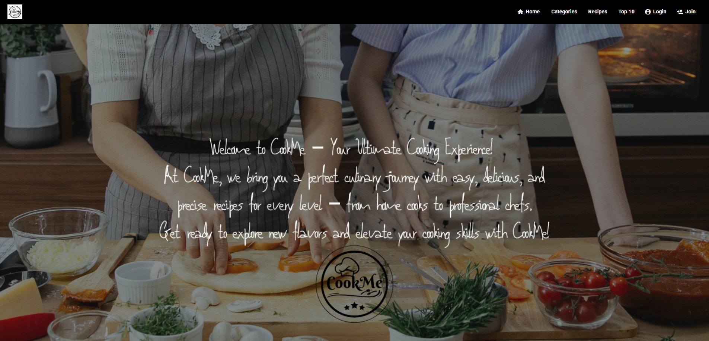

# 'CookMe' Recipe Website

---

## Overview

CookMe Recipe Website is a web-based recipe management system, developed using Angular for the frontend and ASP.NET Core for the backend, following a 3-Tier Architecture structure.  
The system allows users to filter recipes by category, view detailed recipe information, manage user permissions, rate recipes, and display the top 10 recipes based on a smart scoring algorithm.

---

## Main Objectives

- Develop an interactive and user-friendly platform for recipe management  
- Integrate between the frontend and backend using RESTful API  
- Implement an advanced algorithm for dynamic recipe ranking  
- Ensure secure authentication and authorization mechanisms

---

## Architecture Overview

### Frontend – Angular

- **Modular structure** – organized by feature modules  
- **Lazy Loading** – dynamic loading of modules for better performance  
- **Reactive Forms** – form validation and reactive UI handling  
- **Guard & Interceptor** – route protection and automatic token injection  
- **Service-based communication** – for consistent API interactions  
- **Custom Pipe** – for filtering and transforming display data  
- **Custom Directive** – for managing dynamic component behavior  
- **Shared Module** – reusable components and utilities

### Backend – ASP.NET Core

- **Web API** – Controllers for core entities (Recipe, User, Category, etc.)  
- **Service Layer** – business logic abstraction  
- **Core Layer** – DTOs, interfaces, and global contracts  
- **Data Layer** – Entity Framework Core, repositories, and data context  
- **AutoMapper** – entity-to-DTO mapping for clean data handling

---

## Smart Ranking Algorithm – TOP 10 Recipes

The platform includes a dedicated page that displays the **Top 10 recipes**, based on a custom **greedy algorithm** I developed.

The algorithm calculates a **balanced weighted score** for each recipe, based on three key factors:

- **Rating – 50% weight**: Reflects the average user rating for the recipe  
- **Views – 30% weight**: Indicates how popular the recipe is  
- **Difficulty – 20% weight**: Favors simpler recipes, but not absolutely – allowing complex recipes to still rank

### Fairness and Reliability

The algorithm also takes into account the **number of raters**:

- For example, a recipe with two 5-star ratings will not be treated as perfect — it will be weighted against the site's overall rating average.  
- Conversely, a recipe with 100 ratings and a 4.5 average will receive preference, as its data is statistically more reliable.

Additionally, a **minimum rating threshold** is defined:  
Only recipes with a sufficient number of ratings are included in the scoring process, ensuring the rankings are not skewed by a small sample size.

Finally, the algorithm selects the top 10 recipes with the **highest weighted scores**, which are displayed on the TOP10 page.

---

## Key Features

- Recipe management by categories: Meat, Dairy, Parve  
- Recipe cards showing: Name, Title, Ingredients Count, Prep Time, Difficulty, Views, and Ratings  
- Detailed recipe view with full instructions and ingredients  
- Responsive and user-friendly interface  
- User registration and secure login  
- Access control using route guards  
- Recipe rating available for registered users only

---

## Screenshots


---

## Technologies Used

| Layer        | Technologies                          |
|--------------|----------------------------------------|
| Frontend     | Angular 18, TypeScript, HTML, CSS     |
| Backend      | ASP.NET Core, C#                      |
| Architecture | 3-Tier: API, Service, Data            |
| Database     | SQL Server, Entity Framework Core     |
| Authentication | JWT Token Authentication            |
| Dev Tools    | AutoMapper, Swagger (optional), Reactive Forms |

---

## How to Run the Project

### Frontend (Angular)

```bash
git clone https://github.com/Michali24/RecipeWebsite.git
cd RecipeApp
npm install
ng serve
